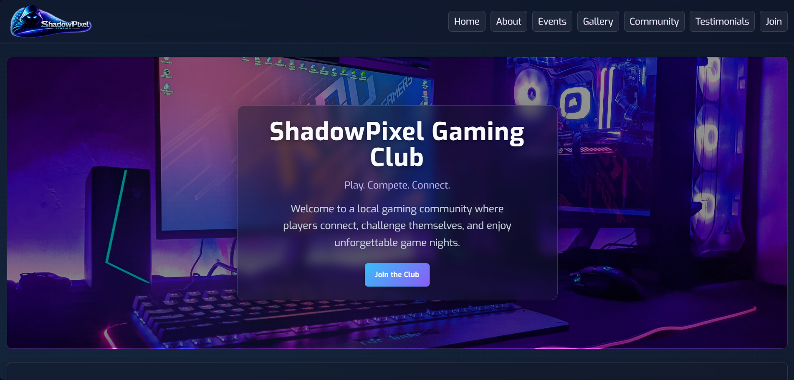
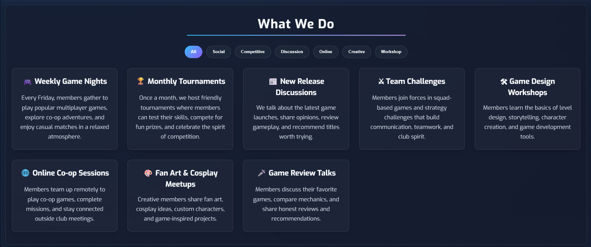
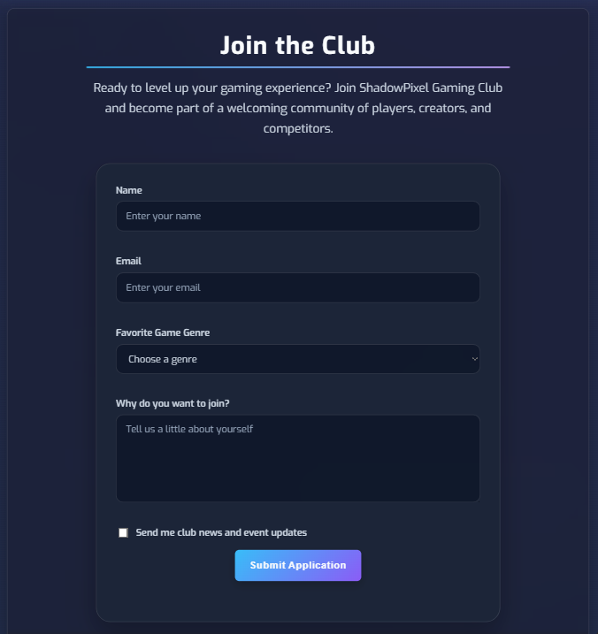
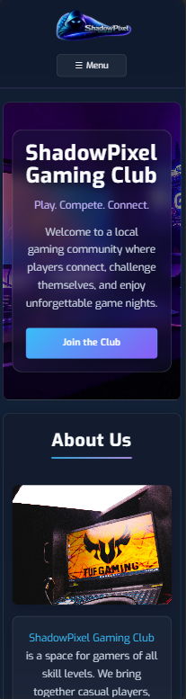

<p align="center">
  
</p>

<h1 align="center">🎮 ShadowPixel Gaming Club</h1>

<p align="center">
  A fictional gaming community website designed and developed <b>from scratch</b> as a front-end portfolio project.
</p>

<p align="center">
  
  
  
  
  
  
  
</p>

<p align="center">
  
  
</p>

<p align="center">
  <a href="https://amirabenameur3.github.io/ShadowPixel-Gaming-Club/">
  
  </a>
</p>

---

## 📑 Table of Contents

- [📖 About the Project](#-about-the-project)
- [✨ Features](#-features)
- [⚙️ JavaScript Features](#️-javascript-features)
- [🧩 Technical Highlights](#-technical-highlights)
- [🧠 Challenges & Solutions](#-challenges--solutions)
- [🌿 Git Workflow](#-git-workflow)
- [🛠 Built With](#-built-with)
- [🎬 Demo](#-demo)
- [📸 Screenshots](#-screenshots)
- [🧠 Key Concepts Practiced](#-key-concepts-practiced)
- [🎨 Design Highlights](#-design-highlights)
- [📂 Project Structure](#-project-structure)
- [🎯 Learning Objectives](#-learning-objectives)
- [🚧 Future Improvements](#-future-improvements)
- [👩‍💻 Author](#-author)
- [📌 Disclaimer](#-disclaimer)

---

## 📖 About the Project

**ShadowPixel Gaming Club** is a fictional gaming community website created as a modern **front-end portfolio project**.

The project simulates a gaming club where players gather to participate in tournaments, community events, and online activities through an immersive and interactive website experience.

Originally started as an HTML/CSS project, the website gradually evolved into a more advanced front-end application with **JavaScript interactivity, responsive navigation, dynamic UI behaviors, accessibility enhancements, and reusable component patterns**.

The project focuses on building a polished real-world landing page experience while practicing modern front-end development fundamentals.

### Main goals of the project

- practice semantic and accessible HTML structure
- build responsive layouts with modern CSS
- create interactive UI components using JavaScript
- improve user experience with animations and dynamic behaviors
- organize scalable and reusable project architecture
- strengthen Git and GitHub workflow practices

---

## 🌐 Live Demo

You can explore the live version of the website here:

👉 https://amirabenameur3.github.io/ShadowPixel_Studios/

Deployed with **GitHub Pages**

---

## ✨ Features

### 🎮 Core Sections

- Hero section introducing the gaming club
- About section explaining the club's mission
- Events section presenting gaming activities
- Gallery section showcasing gaming moments
- Community section featuring members
- Testimonials section with fictional feedback
- Join section with validated contact form

### ⚡ Interactive Features

- Responsive mobile navigation menu
- Scroll reveal animations using Intersection Observer
- Gallery lightbox with image navigation
- Event category filtering system
- Live countdown timer for tournaments/events
- Real-time form validation with custom error handling
- Dynamic UI states and transitions
- Sticky header behavior on scroll

### ♿ Accessibility Features

- Semantic HTML structure
- ARIA attributes for interactive components
- Keyboard-friendly navigation
- Focus-visible styles for accessibility
- ESC key support for overlays and menus

### 📱 Responsive Design

- Optimized layouts for desktop, tablet, and mobile
- Flexible layouts using Flexbox and CSS Grid
- Mobile-first responsive adjustments
- Adaptive spacing and scalable typography

---

## ⚙️ JavaScript Features

The project includes several custom JavaScript functionalities built without external frameworks:

- responsive mobile navigation menu
- scroll reveal animations using Intersection Observer
- gallery lightbox system with navigation controls
- countdown timer for upcoming tournaments
- event filtering functionality
- sticky header behavior on scroll
- reusable modal and toggle logic
- real-time form validation
- keyboard accessibility enhancements
- dynamic UI state management

---

## 🧩 Technical Highlights

- Built entirely with vanilla JavaScript without external frameworks
- Reusable UI logic for menus, filters, and interactive components
- Organized event-driven architecture for interface interactions
- Accessibility-focused implementation with keyboard support and ARIA attributes
- Modular and scalable styling approach using CSS custom properties
- Responsive layouts optimized across multiple breakpoints
- Feature-branch Git workflow simulating real-world development practices

---

## 🧠 Challenges & Solutions

### Responsive Navigation

One challenge was creating a responsive mobile navigation system that remained accessible and easy to maintain.  
This was solved by implementing reusable toggle functions, dynamic UI states, keyboard accessibility support, and responsive layout adjustments.

### Gallery Lightbox

The gallery lightbox required careful positioning and responsive behavior across different screen sizes.  
Navigation controls and overlay interactions were refined to improve usability on mobile devices.

### Form Validation

The join form validation system was built using reusable validation functions and real-time feedback to improve the user experience while keeping the code maintainable.

---

## 🌿 Git Workflow

The project was developed using a feature-branch workflow:

- separate branches for major features
- incremental commits for isolated improvements
- merge-based integration into the main branch
- branch cleanup after feature completion

This workflow helped simulate real-world collaborative development practices.

---

## 🛠 Built With

- **HTML5**
- **CSS3**
- **JavaScript (ES6+)**
- **Flexbox**
- **CSS Grid**
- **Intersection Observer API**
- **Responsive Design**
- **Google Fonts**
- **Git & GitHub**

---

## 🎬 Demo

<p align="center">
  
</p>

---

## 📸 Screenshots

### Home Page
<p align="center">
  
</p>

### About Section
<p align="center">
  
</p>

### Events Section
<p align="center">
  
</p>

### Gallery Section
<p align="center">
  
</p>

### Community Section
<p align="center">
  
</p>

### Testimonials Section
<p align="center">
  
</p>

### Join Section
<p align="center">
  
</p>

### Mobile Layout
<p align="center">
  
</p>

---

## 🧠 Key Concepts Practiced

### HTML & Accessibility

- Semantic HTML structure
- Accessible navigation patterns
- ARIA attributes and keyboard interactions

### CSS & Responsive Design

- CSS variables and design tokens
- Responsive layouts with Flexbox and Grid
- Glassmorphism and layered UI effects
- Media queries and adaptive layouts
- Reusable utility and component styling

### JavaScript

- DOM manipulation
- Event handling
- Form validation
- Dynamic class toggling
- Intersection Observer API
- Countdown timer logic
- Lightbox functionality
- Filtering systems
- Reusable UI functions

### Workflow & Tooling

- Git branching and merging workflow
- Incremental feature development
- Project structure organization
- GitHub Pages deployment

---

## 🎨 Design Highlights

- Modern gaming-inspired UI with dark neon aesthetics
- Glass-style panels using `backdrop-filter`
- Gradient accents and glowing hover effects
- Animated reveal-on-scroll transitions
- Responsive mobile navigation experience
- Card-based layouts for scalable content sections
- Reusable component structure across the website
- Consistent visual hierarchy using CSS custom properties
- Smooth transitions and micro-interactions

---

## 📂 Project Structure

```
shadowpixel-gaming-club
│
├── docs
│   ├── ShadowPixel-Gaming-Club-Preview.png
│   ├── about.png
│   ├── community.png
│   ├── demo.gif
│   ├── events.png
│   ├── gallery.png
│   ├── home.png
│   ├── join.png
│   ├── mobile.png
│   └── testimonials.png
│
├── resources
│   ├── css
│   │   └── styles.css
│   └── images
│
├── README.md
├── favicon_shadowpixel.ico
├── index.html
├── main.js
```

---

## 🎯 Learning Objectives

This project helped practice:

- building a complete front-end project from scratch
- structuring scalable and semantic HTML
- designing responsive layouts with modern CSS
- creating reusable UI components
- implementing interactive JavaScript features
- improving accessibility and keyboard usability
- organizing code for maintainability
- using Git branches for feature development
- managing real-world GitHub workflows

---

## 🚧 Future Improvements

Possible future enhancements:

- integrate a backend for real member registration
- connect forms to a database or API
- add authentication and user profiles
- implement dark/light theme switching
- create a tournament management system
- add leaderboard and statistics pages
- integrate gaming-related APIs
- improve animations with advanced motion libraries
- optimize performance and lazy loading
- expand accessibility testing and compliance

---

## 👩‍💻 Author

**Amira Ben Ameur**

PhD Researcher in Structural & Transportation Engineering  
Front-End Development Enthusiast

GitHub:  
[github.com/amirabenameur3](https://github.com/amirabenameur3)

---

## 📌 Disclaimer

This website represents a **fictional gaming community** created for **learning and portfolio purposes**.

It does **not represent a real organization or brand**.

---

## ⭐ If you like the project

Give the repository a **star on GitHub** ⭐
